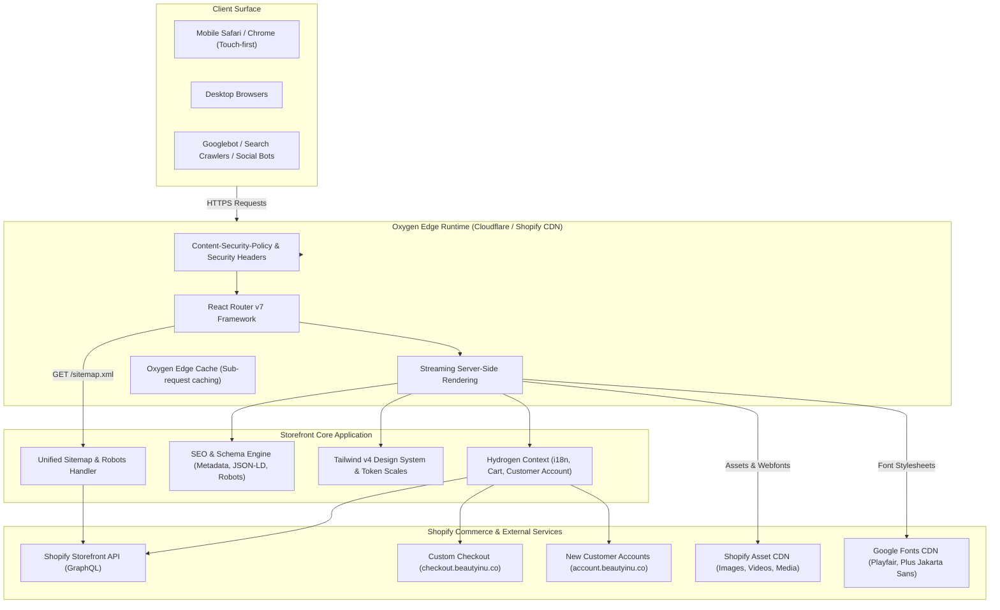
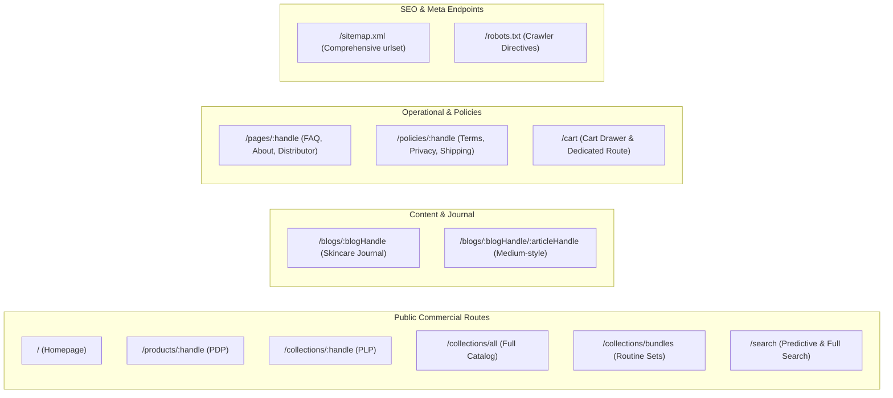
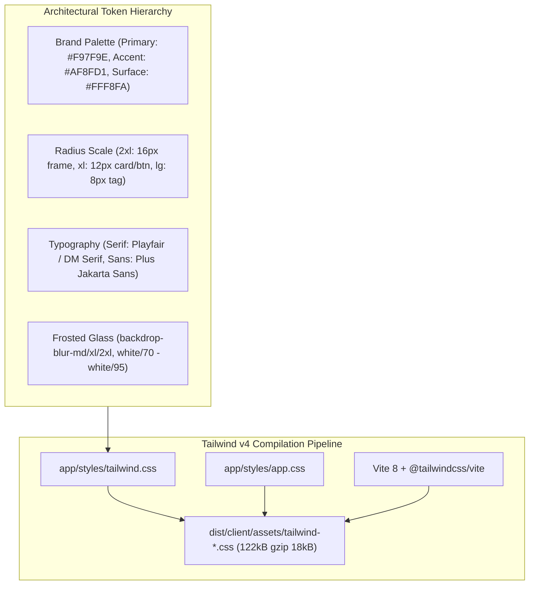
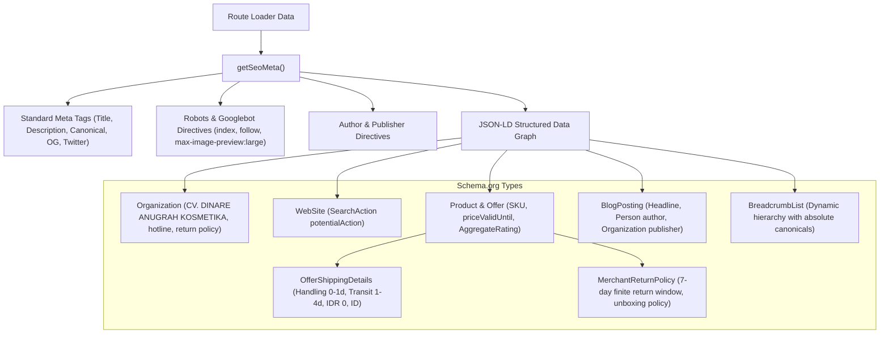

# Beautyinu Storefront — System Map & Architecture

> Canonical system architecture and technical map for the Beautyinu Headless Storefront.
> Built on Shopify Hydrogen (Oxygen edge runtime) & React Router v7 framework.

---

## 1. System Map & High-Level Architecture

---

## 2. Route Topology & Page Matrix

Beautyinu implements a lean, high-conversion headless eCommerce routing structure:

### Detailed Route Specifications

| Path | File | Purpose | Data Queries | Key Features |
|---|---|---|---|---|
| `/` | `app/routes/_index.tsx` | Brand flagship landing page | Hero slides, Category splits, Actives, Bundles, Best Sellers | Responsive WebP slider, 3-step routine cards, Social proof |
| `/products/:handle` | `app/routes/products.$handle.tsx` | Product detail page | Single product, variants, metafields, recommendations | Dynamic media gallery, mobile medal sticky CTA, Shopee reviews |
| `/collections/:handle` | `app/routes/collections.$handle.tsx` | Category archive | Collection products, pagination | Frosted category tags, sort dropdown, quick-add cards |
| `/collections/all` | `app/routes/collections.all.tsx` | Master store catalog | All active products | Filter chips, sort selector, responsive product grid |
| `/blogs/:blogHandle` | `app/routes/blogs.$blogHandle._index.tsx` | Editorial hub | Blog articles, pagination | Medium-style editorial concept, author spotlight, search tags |
| `/blogs/:blogHandle/:articleHandle` | `app/routes/blogs.$blogHandle.$articleHandle.tsx` | Longform article | Single article, author, related articles | Reading progress bar, TOC, floating share pill, clinical table |
| `/pages/:handle` | `app/routes/pages.$handle.tsx` | CMS & informative | Shopify Page resource | FAQ accordions, Distributor portal, About story |
| `/sitemap.xml` | `app/routes/[sitemap.xml].tsx` | Unified XML sitemap | Storefront `sitemap(type: ...)` | 100% direct `<urlset>` (35 URLs) with lastmod, changefreq, priority |
| `/robots.txt` | `app/routes/[robots.txt].tsx` | Search bot directives | Dynamic host detection | Sitemap linkage, disallow internal search, bots rate limiting |

---

## 3. Design System & Styling Architecture

Beautyinu uses **Tailwind CSS v4** with a pure CSS-first configuration:

### Radius Token Hierarchy (Anti-Slop Standard)
- **Container / Modal Frame**: `rounded-2xl` (`16px`)
- **Product Card / CTA Button**: `rounded-xl` (`12px`)
- **Internal Thumbnail / Sub-container**: `rounded-lg` (`8px`)
- **Micro Badge / Formula Tag**: `rounded-md` (`6px`)
- **Strict 1:1 Circular Only**: `rounded-full` (nav arrows, slide dots, floating close button)

---

## 4. Content Security Policy (CSP) Whitelist Matrix

Configured in `app/entry.server.tsx` via `@shopify/hydrogen`'s `createContentSecurityPolicy`:

| Directive | Permitted Sources | Rationale |
|---|---|---|
| `default-src` | `'self'`, `https://cdn.shopify.com`, `https://shopify.com` | Base platform security |
| `style-src` | `'self'`, `'unsafe-inline'`, `https://cdn.shopify.com`, `https://fonts.googleapis.com` | Local styles + Google Fonts stylesheets |
| `font-src` | `'self'`, `https://fonts.gstatic.com`, `https://cdn.shopify.com`, `data:` | Google Webfonts (Playfair, Plus Jakarta Sans, DM Serif) |
| `img-src` | `'self'`, `https://cdn.shopify.com`, `https://shopify.com`, `data:`, `blob:` | Product media, CDN assets, SVG icons, previews |
| `connect-src` | `'self'`, `https://checkout.beautyinu.co`, `https://account.beautyinu.co`, `https://cdn.shopify.com`, `https://monorail-edge.shopifysvc.com`, Storefront API | Checkout redirection, customer account API, analytics |

---

## 5. SEO & Structured Data (Schema.org) Pipeline

All structured data is generated deterministically in `app/lib/seo.ts`:

---

## 6. Build, Release & Deployment Pipeline

- **Repository**: `https://github.com/ongkipro/beautyinu`
- **Main Branch**: `main`
- **CI/CD Platform**: GitHub Actions (`.github/workflows/oxygen-deployment-1000180026.yml`)
- **Hosting / Edge Runtime**: Shopify Oxygen (Worker runtime, zero server overhead)
- **Live Production URL**: `https://beautyinu.co`
- **Custom Domains**:
  - Storefront: `https://beautyinu.co`
  - Checkout: `https://checkout.beautyinu.co`
  - Customer Accounts: `https://account.beautyinu.co`
